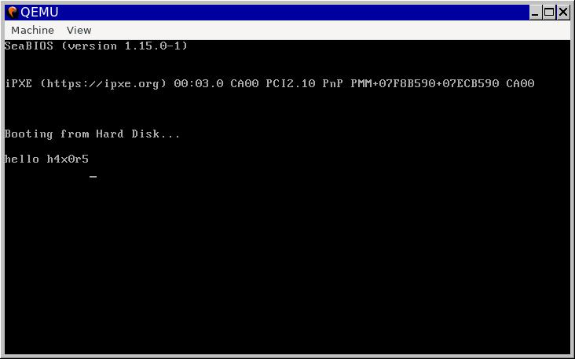

# hellobios



```bash
# instala dependências
sudo apt install clang lld qemu-system-x86 -y

# gera o hello.o
clang -c --target=x86_64-elf -nostdlib -nodefaultlibs -Oz -m16 hello.asm -o hello.o

# gera o hello.bin
ld.lld --oformat binary -T hello.ld -o hello.bin hello.o && hexdump -C hello.bin

# roda a porra toda
qemu-system-x86_64 -hda hello.bin
```

## créditos

baseado no código encontrado em [hikalium/hello_world_with_bios](https://github.com/hikalium/hello_world_with_bios/tree/master/legacy_asm)